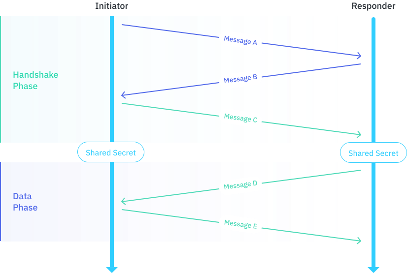

```yaml
Name: Ockam Proposal 0003
Status: Draft
```

# Key Agreement - XX

This proposal specifies a __key agreement protocol__ for two entities to agree
on a shared secret without ever transporting that secret over the network. This
protocol design is based on the `XX` design pattern that is defined in the
[Noise Protocol Framework](#reference-1).

As part of the protocol both entities share their long term static public keys
and prove to each other that they possess the corresponding private keys. This
type of key agreement is most useful in scenarios where the two entities have
never encountered each other before and neither has pre-existing knowledge of
the other entities static public key.

## Description

The Key Agreement protocol begins with two entities exchanging handshake messages.

During this __handshake phase__ the entities exchange Diffie-Hellman public keys
and perform a sequence of Diffie-Hellman operations, hashing the results of those
operations into a shared secret.

After the handshake phase each party can use this shared secret to send encrypted
__data messages__.

The two participating entities are called __Initiator__ and __Responder__:

__Initiator__: The entity that initiates the key agreement protocol by
sending the first message (Message A).\
__Responder__: The entity that responds to the initiator's message with
the second message (Message B).



## References

1. <span id="reference-1"></span>Perrin, T., The Noise Protocol Framework.\
https://github.com/noiseprotocol/noise_spec/blob/v34/output/noise.pdf

2. <span id="reference-2"></span>Krawczyk, H., SIGMA: The ‘SIGn-and-MAc’ approach
to authenticated Diffie-Hellman and its use in the IKE protocols.\
https://link.springer.com/content/pdf/10.1007/978-3-540-45146-4_24.pdf

3. <span id="reference-3"></span>Marlinspike, M. and Perrin, T.,
The X3DH Key Agreement Protocol.\
https://signal.org/docs/specifications/x3dh/x3dh.pdf

4. <span id="reference-4"></span>Kobeissi, N., Nicolas, G. and Bhargavan, K.,
Noise Explorer: Fully Automated Modeling and Verification for Arbitrary Noise Protocols.\
https://ia.cr/2018/766

5. <span id="reference-5"></span>Girol, G., Formalizing and verifying the security
protocols from the Noise framework.\
https://ethz.ch/content/dam/ethz/special-interest/infk/inst-infsec/information-security-group-dam/research/software/noise_suter-doerig.pdf

6. <span id="reference-6"></span>IETF, The Transport Layer Security (TLS) Protocol Version 1.3\
https://tools.ietf.org/html/rfc8446
